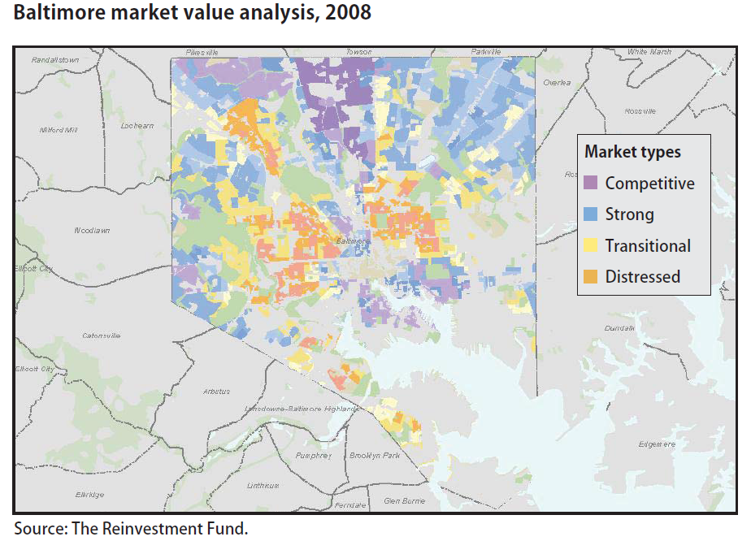
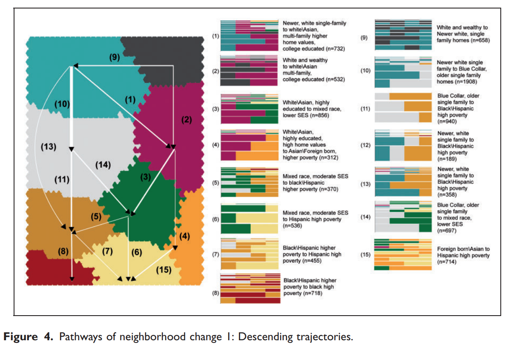

```{r setup, include=FALSE}
knitr::opts_chunk$set(echo = TRUE, message=F, warning=F, eval=T)
library( dplyr )
library( pander )
```


<br>


---

<br>

# A Regression Framework for Neighborhood Change

## Predicting Change 

The previous lab asks you to build a basic model of neighborhood change by selecting variables that have the potential to predict neighborhood change. 

The DV in the model is created by looking at growth in median home values between 2000 and 2010, and the predictors in the model are all variables describing census tract characteristics in 2000. 

This can be described as a prospector model because it only uses data that would be available at the start of the study period to predict changes over the coming decade. 

If you were a real estate developer trying to decide on which neighborhoods you should invest in today, you might build such a model using historic data, then apply the model parameters to current data in order to get predictions of future changes in each tract. You would then purchase investment homes in neighborhoods that have the biggest potential for growth.

Note that this is a **predictive** exercise, not a hedonic model that can help explain the **causal reasons** behind the change in home value. Regression models rely on correlations between events, which allows us to use data to predict changes without necessarily explaining why it occurs. This is also essentially how the human brain learns to forecast future events by recognizing patterns. When we hear thunder we know that it is likely to rain and we seek shelter. Thunder does not cause rain, but it does indicate that it is eminent. Similarly, medicine frequently uses blood markers like specific proteins or white blood cells to identify the presence of cancer. These markets do not cause cancer, but they do predict that a person has the disease. Thunder and rain are correlated. The level of blood markers are correlated with the probability that a specific disease is present in the body. We can build actionable decision models that help us forecast future events using correlation without a deep understanding of the processes that cause the change.   

Our models that rely entirely on census demographics would be overly-simplistic for most serious investors, but the basic framework is sound. The Urban Spatial lab has shown that they can build [accurate neighborhood change models](http://urbanspatialanalysis.com/portfolio/predicting-gentrification-using-longitudinal-census-data/) using housing market data and spatial attributes of tracts like the proximity to other wealthy tracts. 

We might also consider whether the home price trends identified in historic data will be impacted by major changes to public policy and the economy (past performance does not always predict future success). 

## Explaining Change with Regression  

Consider two very similar regression models that are designed for different purposes. 

**Model 1: Predicting Change** 

$$ ( Y_{2010} - Y_{2000} ) = b0 + b1 \cdot X_{2000} $$

**Model 2: Explaining Change**

$$ ( Y_{2010} - Y_{2000} ) = b0 + b1 \cdot ( X_{2010} - X_{2000} ) $$

The first model would help you to identify information from the current time period that can predict increases in home value, whereas the second model will help you identify drivers of price changes. 

Cross-sectional data is extremely sensitive to omitted variable bias. Biased coefficients prevent us from telling a causal story, but not from making predictions. Class size is a good predictor of test performance, but mostly because it is correlated with socio-economic status of students rather than being a cause of test scores (smaller classes are easier to manage, thus reducing class sizes will increase test scores). 

Changes in variable levels over the study period, however, are a better approximation of causal inference. If classroom size is really related to test scores then school districts that reduce class sizes from 2000 to 2010 should experience improvements in test scores over the same period. If a cross-section model of class size is highly predictive of test scores but changes in class size over time are uncorrelated with changes in test performance we would suspect that class size is a proxy measure for the true drivers of test scores but does actually cause the outcome. 

In other word, levels of X can predict outcomes. Changes in levels of X help explain outcomes. This basic insight is the basis of fixed effects models and difference-in-difference models that you will learn more about in CPP 525. 

And a final note on some nuances of regression terminology. When we say that a covariate X is a predictor of Y it means that X is statistically significant in the model - that there is a meaningful correlation between the variables. It does not mean that a one-unit increase in X will lead to a *B1* increase in Y, because the relationship is not causal. 

Focusing on changes in levels of X gets us closer to a causal explanation. Panel models that leverage these types of changes over time do a better job of approximating the types of causal effects (under the right conditions that you will explore more in CPP 525). 

But identifying a variable X as something that likely causes Y does not make it a policy variable, per se, since many drivers of change are not easy to manipulate to create the desired change. 

Compare classroom changes to demographic migrations into a city. We can write a law that mandates class size decrease by 10 students. We cannot write a law that mandates college graduates move to a particular city. An influx of graduates may indeed raise home prices, but the migration is not available as a policy lever since large-scale migration patterns are driven by preferences of individuals and economic trends outside of the control of an the typical urban planner. 

We can **explain change** by identifying **drivers** of change or **explanatory factors** that are causally related to the outcome but cannot be manipulated in the same way that a **policy variable** can be manipulated (e.g. demographic migration patterns are difficult to control). 

In Part II below you will search for explanatory factors that are likely not good policy levers, but can help us build a better understanding of some of the processes driving change in home values. 

## Predicting Changes with Neighborhood Types

The final approach to exploring neighborhood change in this lab is looking at neighborhood types by creating clusters in 2000 to see if the membership in specific groups identified by clustering can predict changes. 

For example, Goldstein (2011) uses data on housing markets at the census block level to construct market groupings using clustering. These groups helped the city of Baltimore identify neighborhoods that were likely to experience home value growth in coming years, those that were likely to decline, and those that are stable (all useful information for policy-makers and planners).   



*Goldstein, I. (2011). Market value analysis: A data-based approach to understanding urban housing markets. Putting Data to Work: Data-Driven Approaches to Strengthening Neighborhoods, 49.* [pdf](https://github.com/DS4PS/cpp-529-master/raw/master/articles/data-driven-models/MVA-DD-App-to-Strengthening-Neighborhoods.pdf)

These groups were constructed using clustering methods similar to what you have done in previous labs, except the inputs in Goldstein's study described housing characteristics and we have used demographic variables that mostly describe population characteristics. The variables in Goldstein's model were: 

* variability of housing sale prices
* housing and land vacancy
* mortgage foreclosures as a percent of units (or sales)
* rate of owner occupancy
* proportion of blocks with commercial land use
* share of the rental stock that receives a subsidy
* density

Recall that Delmelle (2017) used demographic variables primarily to develop clusters, and the clusters followed a predictable developmental path over time. 

*Delmelle, E. C. (2017). Differentiating pathways of neighborhood change in 50 US metropolitan areas. Environment and planning A, 49(10), 2402-2424.* [pdf](https://github.com/DS4PS/cpp-529-master/raw/master/articles/data-driven-models/differentiating_pathways_to_neighborhood_change.pdf)




In the final part of the lab you will see if knowing the type of neighborhood in the year 2000 based upon your clustering would help to predict whether the neighborhood is likely to experience changes in home values over the coming decade. 

You can do this by creating clusters using data from 2000, save the group membership information from the clusters, then use the groups in a regression model predicting changes. 


<br> 
<hr> 
<br> 


# Part 1 - Data

Follow the steps from the previous tutorial to create a dataset that includes 2000 and 2010 census variables and make sure to: 

* Drop all rural census tracts.
* Create a variable that measures the growth of median home value from 2000 to 2010. 
* Omit cases that have a median home value less than $1,000 in 2000. 
* Omit cases with growth rates above 200%.  

Print summary statistics about median home values in 2000 and 2010. 

Visualize the distribution of changes across all urban tracts between 2000 and 2010 (these are replications of steps in the tutorial). 

<br> 
<hr> 
<br> 


# Part 2 - Predict MHV Change 

Replicate steps from your previous lab (you can select three new variables if you like): 

Select three neighborhood characteristics from 2000 that you feel will be good predictors of change in MHV between 2000 and 2010. Note these are static snapshots of the tracts in 2000. 

Check for variable skew on each of the variables by generating a histogram and summary statistics. Correct skew if necessary. 

Create a correlation plot for your three variables. Are any of them highly-correlated? Do you expect multicollinearity to be a problem? 

Run two models - one with change in median home value (dollar amount) and one with median home value growth (percent change) from 2000 to 2010 as the dependent variables, and include your three year 2000 tract descriptors as covariates. 

Report whether any of the variables is a good predictor of home value change. 

<br> 
<hr> 
<br> 


# Part 3 - Explain MHV Change

Repeat the steps you just completed in Part 2 except now use **changes in levels** of your three covariates instead of the 2000 covariate levels. 

Calculate changes by subtracting the 2000 values from the 2010 values of your independent variables (you have already calculated the change in Y in the same way). 

Re-run your two regression models, but now using the 2000-2010 changes in X instead of the 2000 levels of X. 

Were there any cases where the levels of X in 2000 did not predict home value change, but the changes in levels of X between 2000 and 2010 did, or vice-versa? 

Explain how the interpretation of each *B* coefficient changes between Part 2 and Part 3. 

<br> 
<hr> 
<br> 


# Part 4 - Predicting Change with Neighborhood Type

Parts 2-3 utilize data on all urban census tracts across the country. 

For Part 4 use data **from your study city only**. 

Replicate steps from Lab 03 to create groups by clustering the census data in your city. 

```{r, eval=F}
# run your clustering model 
fit <- Mclust( d3 )

# save group membership for each tract 
d3$cluster.group <- as.factor( paste0( "GROUP-", fit$classification ) )
table( d3$cluster.group )

# predict changes as a function of group membership
# y here would be change in median home value 2000 to 2010
lm( y ~ cluster.group - 1, data=d3 )

# box and whisker plot visualizing relationship 
# between cluster groups and home value changes  
plot( d3$cluster.group, d3$y, 
      las=2, frame.plot=F, outline=F, xaxt="n", 
      main="Cluster Groups"  )
```


You do not have to re-create the group descriptive variables here, you can re-use the group labels that you created in the previous lab if you like. 

You can rename the groups as follows:  

```{r, eval=F}
d3$cluster.group[ d3$cluster.group == "GROUP-1" ] <- "your group label 1"
d3$cluster.group[ d3$cluster.group == "GROUP-2" ] <- "your group label 2"
# etc
```


-----


<br>

# Submission Instructions

Record your work in an RMD file where you can document your code and responses to the questions. Knit your RMD file and include your rendered HTML file. 

Note that this lab will become one chapter in your final report. You will save time by drafting the lab as if it is an external report chapter rather than a regular lab. 

Login to Canvas at <http://canvas.asu.edu> and navigate to the assignments tab in the course repository. Upload your zipped folder to the appropriate lab submission link.

Remember to:

* name your files according to the convention: **Lab-##-LastName.Rmd**
* show your solution, include your code.
* do not print excessive output (like a full data set).
* follow appropriate style guidelines (spaces between arguments, etc.).

See [Google's R Style Guide](https://google.github.io/styleguide/Rguide.xml) for examples.


---

<br>

## Notes on Knitting

If you are having problems with your RMD file, visit the [**RMD File Styles and Knitting Tips**](https://ds4ps.org/cpp-526-spr-2020/labs/r-markdown-files.html) manual.

Note that when you knit a file, it starts from a blank slate. You might have packages loaded or datasets active on your local machine, so you can run code chunks fine. But when you knit you might get errors that functions cannot be located or datasets don't exist. Be sure that you have included chunks to load these in your RMD file.

Your RMD file will not knit if you have errors in your code. If you get stuck on a question, just add `eval=F` to the code chunk and it will be ignored when you knit your file. That way I can give you credit for attempting the question and provide guidance on fixing the problem.


<br>
<hr>
<br>

<style>
blockquote {
    padding: 11px 22px;
    margin: 0 0 22px;
    font-size: 18px;
    border-left: 5px solid lightgray;
}

</style>

