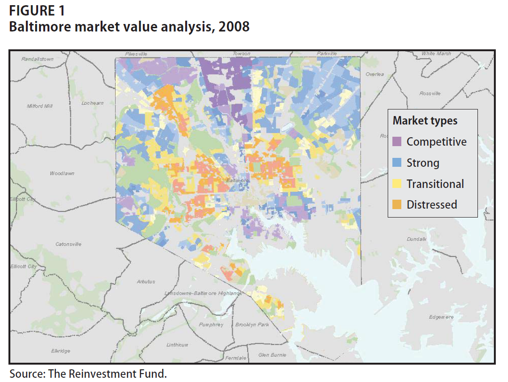

<!--- 
Submit Button - <a class="uk-button uk-button-primary" href="{{page.canvas.assignment_url}}">SUBMIT LAB</a>
-->


<div class = "uk-container uk-container-small">
 

 
<br><br>
<br><br>

**COURSE CONTENT:**

-----------------------

* TOC
{:toc}

-----------------------

<br>


<!--- 
######################################################
####
####      COURSE OVERVIEW
####
######################################################
-->

# Course Overview

## Course Motivation

<iframe width="560" height="315" src="https://www.youtube.com/embed/-DZsZqyU4Bk" frameborder="0" allow="accelerometer; autoplay; encrypted-media; gyroscope; picture-in-picture" allowfullscreen></iframe>


**Neighborhoods Matter**

*Hundreds of studies have demonstrated that the odds of economic success vary across neighborhoods. The far more difficult question is whether that’s because neighborhoods nurture success (or failure), or whether they just attract those who would succeed (or fail) anyway.*

Urban policy scholars have long made the case for the primacy of place:

*Ellen, I. G., & Turner, M. A. (1997). Does neighborhood matter? Assessing recent evidence. Housing Policy Debate, 8(4), 833-866.* [ [pdf](https://github.com/DS4PS/cpp-529-master/raw/master/articles/social-mobility/does-neighborhood-matter-assessing-recent-evidence.pdf) ]

Economists have more recently come to the conclusion that neighborhoods matter more than they expected. For example, see *Justin Wolfers: Why the New Research on Mobility Matters: An Economist's View; The New York Times, May 4, 2015.* [ [link](https://www.nytimes.com/2015/05/05/upshot/why-the-new-research-on-mobility-matters-an-economists-view.html) ] [ [pdf](https://github.com/DS4PS/cpp-529-master/raw/master/articles/social-mobility/why-the-new-research-on-mobility-matters-an-economists-view.pdf) ]

There is growing evidence that neighborhoods can be used as a *treatment* to aid in social mobility, i.e. that programs which help low-income families move to stable and thriving neighborhoods have significant long-term impact on the mobility of the kids. See the Moving to Opportunity Study { [Part 1](https://opportunityinsights.org/paper/newmto/) } and { [Part 2](https://www.citylab.com/equity/2019/08/affordable-housing-assistance-voucher-seattle-neighborhoods/595423/) }.

The Quality of Neighborhoods Varies Significantly

*The report shows how America’s yawning inequality extends beyond just money to wide discrepancies in health, knowledge and education, too. As Stanford economist Rebecca Diamond has suggested, inequality of well-being compounds earnings inequality. Her research finds that more well-off and high-skilled Americans accrue additional benefits from living in neighborhoods with better schools, less crime and enhanced public services. Meanwhile, the less skilled and moneyed Americans are shunted off to communities with low quality schools and services. America’s economic divide registers not just in what we can afford to buy, but in the education we have the opportunity to attain and, most basically, in how much time we have to live.*

The Geography of Well-Being, CITYLAB, Richard Florida, APR 23, 2015 [ [link](https://www.citylab.com/life/2015/04/the-geography-of-well-being/391188/) ] 

A Theory of Neighborhood Change

Neighborhoods don't start out bad. They typically begin as vibrant middle-class developments that pass through various life-cycles over time. Why do some neighborhoods remain stable and thriving, and others experience drastic decline and stagnation? Theories of neighborhod change have been developed to answer that question. 

*Pitkin, B. (2001). Theories of neighborhood change: Implications for community development policy and practice. UCLA Advanced Policy Institute, 28.* [ [pdf](https://github.com/DS4PS/cpp-529-master/raw/master/articles/neighborhood-change-theories/theories-of-neighborhood-change.pdf) ]

**Data-Driven Approaches to Studying Neighborhoods**

Data can help us better understand the impact that neighborhoods have on residents. This class will help you develop a framework around community analytics - using data science tools to identify and describe neighborhoods in cities, and predict how they might change over time. 

We will specifically draw upon approaches described in:

*Firschein, J. (2015). Putting data to work: data-driven approaches to strengthening neighborhoods. IFC Bulletins chapters, 38.* _**Market Value Analysis: A Data-Based Approach to Understanding Urban Housing Markets, pp 41-60.**_ [ [pdf](https://github.com/DS4PS/cpp-529-master/raw/master/articles/data-driven-models/MVA-DD-App-to-Strengthening-Neighborhoods.pdf) ]

Some data-driven models that help [predict which neighborhoods are most likely to change over time](http://urbanspatialanalysis.com/portfolio/predicting-gentrification-using-longitudinal-census-data/). 

And recent academic work that uses census data and machine learning to identify patterns in community development: 

*Delmelle, E. C. (2017). Differentiating pathways of neighborhood change in 50 US metropolitan areas. Environment and planning A, 49(10), 2402-2424.* [ [pdf](https://github.com/DS4PS/cpp-529-master/raw/master/articles/data-driven-models/differentiating_pathways_to_neighborhood_change.pdf) ]

All three articles share a common approach of using census data and clustering techniques to classify neighborhoods by type, then examine how each type is likely to change over time. 

 

<br>

## Course Structure

<iframe width="560" height="315" src="https://www.youtube.com/embed/l1LMI1mMwe4?start=3" frameborder="0" allow="accelerometer; autoplay; encrypted-media; gyroscope; picture-in-picture" allowfullscreen></iframe>

<br>


## Due Dates 

For easy reference, you have the following due dates this term: 

**YellowDig Posts:**

* {{page.yellowdig.post-00}}  
* {{page.yellowdig.post-01}} 
* {{page.yellowdig.post-02}} 
* {{page.yellowdig.post-03}} 
* {{page.yellowdig.post-04}} 
* {{page.yellowdig.post-05}} 
* {{page.yellowdig.post-06}} 
* {{page.yellowdig.post-07}} 


**Labs:** 

* {{page.labs.lab-01}} 
* {{page.labs.lab-02}} 
* {{page.labs.lab-03}} 
* {{page.labs.lab-04}} 
* {{page.labs.lab-05}} 
* {{page.labs.lab-06}} 


**Projects:**

* Code Through: {{page.projects.code-through}}  
* Final Project (Nhood Change Dashboard): {{page.projects.dashboard}} 

<br>
<br>
<br>
<br>
<br>
<br>


# Introduce Yourself   

Introduce yourself to the class via YellowDig. 

Which program or certificate are you part of? Tell us a little about yourself and your career interests in evaluation and analytics. 

--- 

<a class="uk-button uk-button-primary" href="{{page.yellowdig_url}}">YELLOWDIG</a>

**Post by {{page.yellowdig.post-00}}**

--- 

<br>
<br>
<br>
<br>
<br>
<br>


<!--- 
######################################################
####
####      WEEK 1
####
######################################################
-->


# Unit 1 - Measurement & The Theory of Neighborhoods


## Unit Overview

**Description**

This section introduces the field of measurement theory in psychology and social sciences, which is used to create scales or indices that allow us to observe and document things that are not easy to measure. 

<hr>

*Many variables studied by psychologists are straightforward and simple to measure. These include sex, age, height, weight, and birth order. You can often tell whether someone is male or female just by looking. You can ask people how old they are and be reasonably sure that they know and will tell you. Although people might not know or want to tell you how much they weigh, you can have them step onto a bathroom scale.*

*Other variables studied by psychologists—perhaps the majority—are not so straightforward or simple to measure. We cannot accurately assess people’s level of intelligence by looking at them, and we certainly cannot put their self-esteem on a bathroom scale.* 

> **These kinds of variables are called latent CONSTRUCTS** (pronounced CON-structs) and include personality traits (e.g., extraversion), emotional states (e.g., fear), attitudes (e.g., toward taxes), and abilities (e.g., athleticism). [ [Understanding Psychological Measurement](https://opentextbc.ca/researchmethods/chapter/understanding-psychological-measurement/) ]

<hr> 

We are less interested in psychological measures as in constructs of neighborhood quality. But we will use some of the tools developed in psychometrics to help us develop a reliable measure of neighborhood quality. 

**Learning Objectives**

Once you have completed this section you will be able to:

* Define a construct 
* Operationalize measurement reliability 
* List theories of neighborhood change 
* Begin to develop reliable measures of neighborhood quality 

<br>
<hr>
<br>


## Lecture Material 

<hr>

<iframe width="560" height="315" src="https://www.youtube.com/embed/ra5rMqr00Ew?start=192" frameborder="0" allow="accelerometer; autoplay; encrypted-media; gyroscope; picture-in-picture" allowfullscreen></iframe>

<hr>


**Measurement Theory** 

[LECTURE NOTES](https://github.com/DS4PS/cpp-529-master/raw/master/lectures/p-01-measurement.pdf) 

**Lab Preview:** 

On your lab you will be practicing with index development using census data and the following app:

[https://jdlecy.shinyapps.io/measurement-lab/#section-warmup](https://jdlecy.shinyapps.io/measurement-lab/#section-warmup) 

<br>
<hr>
<br>


**Assigned Reading**

Schäffer, U. (2007). Management accounting & control scales handbook. Springer Science & Business Media. [ [2-page PDF](https://github.com/DS4PS/cpp-529-master/raw/master/articles/measurement/introduction-to-construct-measurement.pdf) ] 


Measurement theory defines quantitative measures of latent constructs as: 

```
M = T + e
```

Where M represents the observed measurement (the recorded scores on an IQ test), T represents the *true* scores (each individuals actual intelligence quotion relative to the population), and **e** represents random error. 

Reliability is then the ratio of the variance of the true scores to the variance of the true scores plus measurement error. Note that M, T, and e are vectors of scores. 

```
alpha = var(T) / var( T + e )
```

Alpha is a "signal to error" ratio that tells us how reliable our observed measure will be in capturing the true level of the latent construct. 

Measures like weight or height only require one measurement. Instruments that are designed to measure latent constructs often use multiple measurements that can be helpful in triangulating the underlying construct. For example, all of the verbal reasoning questions on an exam might be combined into a single reading comprehension score. Responses on multiple survey items might be combined into a single index. 

In these cases each **item** can be decomposed into a component X that accurately captures the latent construct and a component **e** which represents random noise or measurement error. 

```
item1 = X1 + e1
```

The index or scale constructed from three items is thus the average of multiple measures: 

```
index = T + e 
where: 
T = X1 + X2 + X3  
e = e1 + e2 + e3
```

The reliability of the index or scale would thus be measured in exactly the same way: *alpha = signal / ( signal + noise )*

```
alpha = var(T) / var( T + e )
```

This holds even when the index is constructed as an average of individual measures to preserve scale. For example, if three appraisers are hired to assess the value of a painting using slightly different methods then it would not make sense to construct a composite value by adding the three individual appraisals. They would be averaged. 

```
index = ( T + e ) / 3  
```

*Under reasonable assumptions the alpha of an index created by summing item scores would be the same as the alpha of an index created by averaging item scores.* 


**For Reference:**

MEASUREMENT THEORY 

*Measurement Theory and Practice, from: Smith, F. (2002). Research methods in pharmacy practice. Pharmaceutical Press.* [ [pdf](https://github.com/DS4PS/cpp-529-master/raw/master/articles/measurement/measurement-theory-and-practice.pdf) ]

*Schäffer, U. (2007). Management accounting & control scales handbook. Springer Science & Business Media.* [ [full text](https://github.com/DS4PS/cpp-529-master/raw/master/articles/measurement/Management-Accounting-and-Control-Scales-Handbook.pdf) ]

*MacKenzie, S. B., Podsakoff, P. M., & Podsakoff, N. P. (2011). Construct measurement and validation procedures in MIS and behavioral research: Integrating new and existing techniques. MIS quarterly, 35(2), 293-334.* [ [pdf](https://github.com/DS4PS/cpp-529-master/raw/master/articles/measurement/construct-measurement-and-validation-in-behavioral-research.pdf) ]

<br>
<hr>
<br>


## Lab 01 - Measurement 

> Due {{page.labs.lab-01}}

<br>
<hr> 

<iframe width="560" height="315" src="https://www.youtube.com/embed/xKV8QPtH52w?start=8" frameborder="0" allow="accelerometer; autoplay; encrypted-media; gyroscope; picture-in-picture" allowfullscreen></iframe>

<hr>
<br>

**Lab Instructions:**

<a class="uk-button uk-button-default" href="../lab-01-instructions/">LAB-01 Instructions</a>

To get you started, skim the following articles in order to get some background information on the study of neighborhood change (decline or revitalization after decline). These studies will help you think about ways in which you might measure neighborhood vitality. 

IMPACT OF NEIGHBORHOODS ON FAMILIES

*Pitkin, B. (2001). Theories of neighborhood change: Implications for community development policy and practice. UCLA Advanced Policy Institute, 28.* [ [pdf](https://github.com/DS4PS/cpp-529-master/raw/master/articles/neighborhood-change-theories/theories-of-neighborhood-change.pdf) ]

*Ellen, I. G., & Turner, M. A. (1997). Does neighborhood matter? Assessing recent evidence. Housing Policy Debate, 8(4), 833-866.* [ [pdf](https://github.com/DS4PS/cpp-529-master/raw/master/articles/social-mobility/does-neighborhood-matter-assessing-recent-evidence.pdf) ]

Your task on Lab 01 will be to create a new **measure of neighborhood health** by identifying several Census variables that can be added together to produce a reliable index (alpha>0.6). 


---

<a class="uk-button uk-button-primary" href="{{page.canvas.assignment_url}}">Submit Lab</a>

**Due on {{page.labs.lab-01}}**

---

The lab uses a custom shiny app and does not require coding. But if you are interested in the behind-the-scenes mechanics see: 

[Tutorial on Building an Index](https://ds4ps.org/cpp-528-spr-2020/labs/lab-02-tutorial.html)

For additional background material on creliability see:

*Kimberlin, C. L., & Winterstein, A. G. (2008). Validity and reliability of measurement instruments used in research. American journal of health-system pharmacy, 65(23), 2276-2284.* [[pdf](https://github.com/DS4PS/cpp-529-master/raw/master/articles/measurement/reliabillity-and-validity-of-measures.pdf)]

Or the "Reliability" section of: 

*Measurement Theory and Practice, from: Smith, F. (2002). Research methods in pharmacy practice. Pharmaceutical Press.* [[pdf](https://github.com/DS4PS/cpp-529-master/raw/master/articles/measurement/measurement-theory-and-practice.pdf)]


<br>
<hr>
<br>


## YellowDig Topic 

Consider the "toxic neighborhood environment" scale developed by Manduca and Sampson:

*Manduca, R., & Sampson, R. J. (2019). Punishing and toxic neighborhood environments independently predict the intergenerational social mobility of black and white children. Proceedings of the National Academy of Sciences, 116(16), 7772-7777.* [ [pdf](https://github.com/DS4PS/cpp-529-master/raw/master/articles/social-mobility/toxic-neighborhoods-and-social-mobility.pdf) ]

--- 

*We use data on intergenerational social mobility by neighborhood to examine how social and physical environments beyond concentrated
poverty predict children’s long-term well-being. First, we examine neighborhoods that are harsh on children’s development: those characterized by high levels of violence, incarceration, and lead exposure....*

*Our explanatory variables are constructed from:*

* *the Community Survey of the PHDCN, which interviewed a representative sample of Chicago residents about their neighborhood social environments in 1995 and 2002 (combined N of ∼12,000);* 
* *violent crime rates per 100,000 population from 1995 to 2000, derived from offenses reported by citizens to the police; incarceration rates per population from 1995 to 2000, derived from prison admission data;* 
* *and lead exposure among children from 1995 to 1997, derived from more than 150,000 blood-level tests conducted by Chicago’s health department.* 

Answer the following question on YellowDig: 

1. Propose one variable not currently included in the metric that you believe would predict low social mobility for children in a neighborhood. Try to suggest variables that have not already been suggested by classmates, and explain why you think they would predict low social mobility.  
2. When constructing indices it's possible to include measures that predict the opposite of the index. When entering them into the measure you would just change the sign. For example, asking people questions about the presence of things that make them happy might elicit different responses than asking them about the presence of things that make them unhappy. They could be combined by flipping the sign of one item. In this case, can you think of a variable that would predict high social mobility in a neighborhood, that could be added to the measure in this way?  
3. Do you think that all of these factors should have an equal weight in the final metric? Or would one of these be more important than others? How much more important (how much would you weight it relative to others)? Share your thoughts.  

---

<a class="uk-button uk-button-primary" href="{{page.yellowdig_url}}">YELLOWDIG</a>

**Post by {{page.yellowdig.post-01}}**

---


<br>
<br>
<br>
<br>
<br>
<br>


<!--- 
######################################################
####
####      WEEK 2
####
######################################################
-->


# Week 2 - Intro to Census Data and Mapping

## Unit Overview


**Description**

This unit will focus on covering two exciting data science topics: (1) Working with Census Data; and (2) Creating choropleth (i.e. color-coded) maps.  The U.S. Census Bureau is the premier source of data about US people, places and economy, making the Bureau a natural source of information for data analysts. 

In general, data scientists using R often run into two problems related to this topic.  First, it can be extremely challenging to understand and find what are the actual data that the Census Bureau publishes.  Second, it can also be challenging to understand what packages in R can be used to efficiently analyze census data.  

This unit will teach students how to resolve both problems, as well as learn mapping tools to effectively transform raw census data into visually appealing choropleth (i.e. color-coded) maps.   This unit includes 4 videos: (1) introduction to Census and Census data; (2) Introduction to Mapping; (3) Mapping Census Data in R; and (4) Mapping Census Data in R with TidyCensus. 

**Assigned Reading**

REQUIRED:

Florida, R. (2018). Where the House-Price-to-Income Ratio Is Most Out of Whack. [Citylab report](https://www.citylab.com/equity/2018/05/where-the-house-price-to-income-ratio-is-most-out-of-whack/561404/)

<br>
<hr>
<br>


## Lecture Material 

**Lecture Notes**

<a class="uk-button uk-button-default" href="../lectures/MappingIntro.html">SLIDES</a>

<br>

**Introduction to Census Data**

<br>

<iframe width="560" height="315" src="https://www.youtube.com/embed/9722ZtZ1v1g" frameborder="0" allow="accelerometer; autoplay; encrypted-media; gyroscope; picture-in-picture" allowfullscreen></iframe>

<br>
<br>

**Introduction to Mapping**

<br>

<iframe width="560" height="315" src="https://www.youtube.com/embed/peSI3dQ1Bbg" frameborder="0" allow="accelerometer; autoplay; encrypted-media; gyroscope; picture-in-picture" allowfullscreen></iframe>

<br>
<br>


**Mapping Census Data in R**

<br>

<iframe width="560" height="315" src="https://www.youtube.com/embed/Jys5nZFRf28" frameborder="0" allow="accelerometer; autoplay; encrypted-media; gyroscope; picture-in-picture" allowfullscreen></iframe>

<br>
<br>


**Mapping Census Data in R w/ TidyCensus**

<br>

<iframe width="560" height="315" src="https://www.youtube.com/embed/qScoFj5ifTY" frameborder="0" allow="accelerometer; autoplay; encrypted-media; gyroscope; picture-in-picture" allowfullscreen></iframe>

<br>
<br>
<hr>
<br>
<br>

## Lab 02 

<br>

<iframe width="560" height="315" src="https://www.youtube.com/embed/CLMEqpf_3Xo" frameborder="0" allow="accelerometer; autoplay; encrypted-media; gyroscope; picture-in-picture" allowfullscreen></iframe>

<br> 

**Lab Instructions**

<a class="uk-button uk-button-default" href="../LABS/lab-02-instructions.html">LAB-02 Instructions</a>

Download the Rmarkdown file (.RMD) below.  In steps 1-4, you can input your R code chunk in the areas that say ``#edit me``.  In Questions 1-3, you can simply answer the questions (i.e. you do not need to show or include any additional code needed to answer the questions).  

[Lab 2 RMD](https://raw.githubusercontent.com/DS4PS/cpp-529-fall-2020/main/LABS/lab-02-template.rmd) *right-click and save as an RMD file*

Submit both the .RMD file and .HTML file to Canvas:

---

<a class="uk-button uk-button-primary" href="{{page.canvas.assignment_url}}">Submit Lab</a>

**Due {{page.labs.lab-02}}**

---

<br>


## YellowDig Topic

**How local governments ensure an accurate census**

Every 10 years, the U.S. Census Bureau conducts a census to determine the number of people living in the United States. 

The data collected by the decennial census are used to determine the number of seats each state has in the U.S. House of Representatives as well as used to inform federal spending and other important federal and state functions.  The task of the census is simple to state yet difficult to execute: count everyone once (no undercount), only once (no overcount), and in the right place (no location errors).

> For your discussion topic this week, please read and provide general reflection based on the following  two articles [article 1](https://gcn.com/articles/2018/02/12/local-gov-correct-census-addresses.aspx) and [article 2](https://www.amacad.org/news/2020-census-unprecedented-challenges-their-implications).  Discuss also what are some of the challenges faced and new innovations adopted by federal and state governments to ensure an accurate census. 

Please post your reflection as a new pin on YellowDig:

--- 

<a class="uk-button uk-button-primary" href="{{page.yellowdig_url}}">YELLOWDIG</a>

**Post by {{page.yellowdig.post-02}}**

---


<br>
<br>
<br>
<br>
<br>
<br>


<!--- 
######################################################
####
####      WEEK 3
####
######################################################
-->


# Week 3 - Identifying Neighborhood Types with Cluster Analysis

## Unit Overview

**Description**

Neighborhood change is a complicated concept with a lot of loaded terminology. We might think about neighborhoods that are "revitalized", "gentrified", that are "stable", or that "decline". For the labels to be meaningful each group should be mutually exclusive and sufficiently distinct from other groups in the taxonomy. 

These labels are a bit loaded because they come with tacit value-judgements. Stable is desireable, revitalization is good, but gentrification is often considered bad. 

This example is just one way that we can think about classifying census tracts by assigning similar ones into coherent groups. 

In this unit, we will be learning how to implement cluster analysis in R as a data reduction technique.  We will classify census tracts in the Pheonix area into groups (or neighborhoods) that can be defined on the basis of certain characteristics. 

You can explore one example by examining how botanists might create "species" based upon characteristics of flowers:

[Clustering Example](https://shiny.rstudio.com/gallery/kmeans-example.html)

A data-driven approach to understanding neighborhood change requires use to (1) define "neighborhoods", or groups of census tracks in the data that are very similar, and (2) use those group characteristics at a point in time to predict how the "neighborhood" might change in the future. This unit focuses on Step (1) - identifying clusters.

Later on we will see how we might use group membership to make predictions with the data. For example, can a city forecast how it's current neighborhoods are likely to change over the next decade? Does the current group status of a community give us reliable information about how it might change over time? These sorts of insights can help with urban planning processes. 

**Assigned Reading** 

Skim the article - you are not expected to understand all of the technical details. Instead, focus on the general framework of identifying groups then using group membership to forecast how neighborhoods are likely to change in the future. 

Spend time on pages 2412-2413. See if you can make sense of how groups are being defined within this study. 

Delmelle, E. C. (2017). Differentiating pathways of neighborhood change in 50 US metropolitan areas. Environment and planning A, 49(10), 2402-2424. [ [PDF](https://github.com/DS4PS/paf-586-summer-2019/raw/master/Reading/differentiating-pathways-of-neighborhood-change.pdf) ]


## Lecture Material 

**An Overview of Cluster Analysis** 

The first video below introduces cluster analysis and a simple partitioning algorithm used to segment data into specific partitions or groups.  

The second video below introduces other popular clustering methods -- Hierarchical and model-based clustering.  Model-based clustering is the method we will use in R with the MClust package. The lecture notes can be found [here (PPT)](https://github.com/DS4PS/cpp-529-master/raw/master/lectures/ClusBasic.ppt).

<br>

<iframe width="560" height="315" src="https://www.youtube.com/embed/U8zHi32KnJo" frameborder="0" allow="accelerometer; autoplay; encrypted-media; gyroscope; picture-in-picture" allowfullscreen></iframe>

<br>
<br>

<iframe width="560" height="315" src="https://www.youtube.com/embed/-_oPRGATOBw" frameborder="0" allow="accelerometer; autoplay; encrypted-media; gyroscope; picture-in-picture" allowfullscreen></iframe>


## Lab 03

**Overview** 

The purpose of Lab 3 is to show you how to apply model-based clustering to classify Phoenix neighborhoods into meaningful groups. 

First, read-through the tutorial below on identifying coherent "neighborhoods" or groups using clustering. 

Next, download the Rmarkdown file ([RMD](https://ds4ps.org/cpp-529-master/labs/lab-03-tutorial.rmd)) and execute each code chunk step-by-step to understand each stage of the process. You do not need to submit a knitted file, though.   

You can gain some intuition for the clustering algorithms by looking at examples of how botanists might create "sub-species" by finding groups of plants that share similar characteristics:

[Clustering Example](https://shiny.rstudio.com/gallery/kmeans-example.html)

For any given number of groups that you desire the algorithm will identify how to split the data up so that it maximizes within-group similarities and between-group differences. 

**Lab Instructions**

**PART 01**: Labeling Phoenix Neighborhood Types

<a class="uk-button uk-button-default" href="../LABS/lab-03-tutorial.html">LAB-03 Code-Through</a>

Once you have replicated the steps of the tutorial, you will have assigned Phoenix census tracts into 8 unique groups.  

You are now ready for the fun part -- giving a label to each group. To do this, you need to visually inspect which census variables are prominent in each group and make an informed opinion about what type of label to apply.  

Labels should be informative. There will always be a trade-off between precision labels (literal and dry but unambiguous) and colorful labels (metaphors, playful, easy to remember). Your task is to create a set of labels that balances these two considerations without offending anyone with stereotypes (please be respectful). 

> Propose labels for Groups 1-8 constructed during Lab 3 using cluster analysis **Image 1** below.  In order to provide an appropriate label, you must do a careful inspection of how the census variables overall relate to a particular group **Image 2**. A good label will be catchy and descriptive of the population within the neighborhood cluster.

<br>

Image 1:


<br> 

Image 2:


<br>
<br>


**PART 02**: Other Neighborhood Cluster Models

Skim the following two papers: 

*Market Value Analysis: A Data-Based Approach to Understanding Urban Housing Markets. pp 49-59* [ [**PDF**](https://github.com/DS4PS/paf-586-summer-2019/raw/master/Reading/MVA-DD-App-to-Strengthening-Neighborhoods.pdf) ]

*Delmelle, E. C. (2017). Differentiating pathways of neighborhood change in 50 US metropolitan areas. Environment and planning A, 49(10), 2402-2424.* [ [**PDF**](https://github.com/DS4PS/paf-586-summer-2019/raw/master/Reading/differentiating-pathways-of-neighborhood-change.pdf) ]

These data-driven approaches that use machine-learning algorithms to "discover" coherent communities within the city by grouping census tracks into groups that minimize within-group differences and maximize between-group differences. 

A data-driven approach to understanding neighborhood change requires use to (1) define "neighborhoods", or groups of census tracks in the data that are very similar, and (2) use those group characteristics at a point in time to predict how the "neighborhood" might change in the future. Both of the papers present variations on Step (1) above.

Read the two papers then answer the following questions:

1. **What type of data was used for clustering in the MVA paper (paper 1)? What do the variables measure, and how many were used?**
2. **What type of data was used for clustering in the Differentiating Pathways paper (paper 2)? What do the variables measure, and how many were used?**
3. **Table 1 in Differentiating Pathways (page 2412) is equivalent to the tables you used for PART 01 above except it uses a colored table instead of a chart. Can you identify one neighborhood type from this model that is similar to a neighborhood type that you labeled above?**

**Write up your responses in a word document. There is no code component of the assignment this week**

*Reminder:* Name your file according to the convention: Lab-##-LastName.xxx

You do not need to include your RMD/HTML file for this step with your solutions. You will replicate these steps next week, though, as part of the lab.  

---

<a class="uk-button uk-button-primary" href="{{page.canvas.assignment_url}}">Submit Lab</a>

**Due {{page.labs.lab-03}}**

---

<br>
<br>


## Yellowdig Topic

Post your reflection as a new pin: 

Think back to the lab on creating latent construct measures. 

What is the relationship between a latent construct and a group identified by clustering? 

Do you think the groups that the model found are valid? 

Do you think they are reliable? 

> With those ideas in mind, discuss the strengths and weaknesses of these data-driven approaches to identifying neighborhoods. When do you think they work well, and when do you think they will be misleading? 

---

<a class="uk-button uk-button-primary" href="{{page.yellowdig_url}}">YELLOWDIG</a>

**Post by {{page.yellowdig.post-03}}**

---

<br>
<br>
<br>
<br>
<br>


<!--- 
######################################################
####
####      WEEK 4
####
######################################################
-->


# Week 4 - More Practice Clustering 

We are interesting in understanding neighborhood change. These data-driven approaches to the phenomenon use machine-learning algorithms to "discover" coherent communities within the city by grouping census tracks into groups that minimize within-group differences and maximize between-group differences. 


## Lab 04

**Overview**

The purpose of Lab 4 is to replicate the work you did for the previous lab, but instead of using the Phoenix data you will select a city of your choice to use for this lab, and the final project.

**Lab Instructions**

<a class="uk-button uk-button-default" href="../LABS/lab-04-instructions.html">LAB-04 Instructions</a>

**Submit Solutions to Canvas**

---

<a class="uk-button uk-button-primary" href="{{page.canvas.assignment_url}}">Submit Lab</a>

**Due {{page.labs.lab-04}}**

---

<br>

**Notes on Saving Your Cartogram for Future Use**

You will be re-using your cartogram in future labs. You can create your cartogram from scratch each time, or simply save your cartogram as a geojson map file, and you can re-load it when you need it. 

<a class="uk-button uk-button-default" href="../LABS/save-dorling-cartogram.html">Save Your Cartogram</a>


```r
library( geojsonio )

# data frame and polygon ID standardization in case a tract was dropped and IDs don't match
row.ids <- sapply( slot( phx_dorling, "polygons" ), function(x) slot( x, "ID" ) )
row.names( phx_dorling ) <- row.ids

# project to standard lat-lon coordinate system 
phx_dorling <- spTransform( phx_dorling, CRS("+proj=longlat +datum=WGS84") )

# write to file 
geojson_write( phx_dorling, file="phx_dorling.geojson", geometry="polygon" )
```

Load your cartogram: 

```r
library( geojsonio )
library( sp )

# load from github
github.url <- "https://raw.githubusercontent.com/DS4PS/cpp-529-master/master/data/phx_dorling.geojson"
phx <- geojson_read( x=github.url,  what="sp" )

# from local file path
phx <- geojson_read( "data/phx_dorling.geojson", what="sp" )

plot( phx )
```


<!--- 


<br>
<br>


## Lecture

Geography and Economic Success

A new study by the Harvard economists Raj Chetty and Nathaniel Hendren, when read in combination with an important study they wrote with Lawrence Katz, makes the most compelling case to date that **good neighborhoods nurture success**... they are the most powerful demonstration yet that neighborhoods — their schools, community, neighbors, local amenities, economic opportunities and social norms — are a critical factor shaping your children’s outcomes. It’s an intuitive idea, although the earlier evidence for it had been surprisingly thin.

Chetty's work has brought new insight to the question:  


<br>
<br>
(Note: Audio begins at the 10 second mark.)

<iframe width="560" height="315" src="https://www.youtube.com/embed/Q7nzIOHTSto?start=2000" frameborder="0" allow="accelerometer; autoplay; encrypted-media; gyroscope; picture-in-picture" allowfullscreen></iframe>

<br>
<br>


***Reminder:*** Include the four questions, along with your answers from the reading assignment (see above) at the beginning of your RMD file. 

-->


<br>
<br>
<br>
<br>
<br>


<!--- 
######################################################
####
####      WEEK 5
####
######################################################
-->


# Week 5 - Visualizing Neighborhood Changes  


## Unit Overview


In this unit, a brief video introduction is given related to neighborhood change and gentrification, serving as important foundation for our data science work using census data to visualize changes in neighborhoods over time.  The second goal of this unit is to offer a set of "good practices" when creating maps to display spatial information.  


**Neighborhood Change**

For this project we will measure neighborhood change as a change in median home values in a community. 

Home values are a reliable measure of qualitative changes to a neighborhood because the sales price of a home already takes into account all improvements to the home, as well as all improvements to the surrounding community like new parks, improves schools, and enhanced amenities like gyms and grocery stores. These are called "hedonic pricing models" in economics. Things like income levels or unemployment rates can change independently of improvements or decline in the community, so they are not great measures of neighborhood change. Home values, on the other hand, will typically increase only if demand for the neighborhood has increased, which typically occurs when the neighborhood or surrounding communities improve. 

Read the tutorial on modeling changes in home value:

<a class="uk-button uk-button-default" href="../LABS/lab-05-tutorial-v2.html">NHOOD CHANGE TUTORIAL</a>


**Neighborhood Change and Gentrification**

The first video below provides a general overview of neighborhood change and gentrification, including: defintions, debates,  policies, and a case study example.  The lecture notes can be found [here (PDF)](https://github.com/DS4PS/cpp-529-fall-2020/raw/main/lectures/p-05-visual-narrative.pdf).

<br>

<iframe width="560" height="315" src="https://www.youtube.com/embed/b4GgKBhltu8" frameborder="0" allow="accelerometer; autoplay; encrypted-media; gyroscope; picture-in-picture" allowfullscreen></iframe>

<br>


**Visualization**

---

<a class="uk-button uk-button-default" width="200" href="../LABS/lab-05-choropleth-tutorial.html">CHOROPLETH TUTORIAL</a>

<a class="uk-button uk-button-default" width="200" href="../choropleth-color-scales/">COLOR SCALE INTUITION</a>

---

The video below describes the importance of creating maps that accurately conveys spatial information contained in the underlying data.  Far too often, maps are used incorrectly to advocate a certain narrative that does not accurately reflect underlying data.  As data scientists, it is important that we are careful of how we map spatial information.  The lecture notes can be found [here (PDF)]({{ page.pdf-root-url }}p-05-visual-narrative.pdf).


<br>

<iframe width="560" height="315" src="https://www.youtube.com/embed/AWwOYNvxK-A" frameborder="0" allow="accelerometer; autoplay; encrypted-media; gyroscope; picture-in-picture" allowfullscreen></iframe>


<br>
<br>
<br>


## Lab 05

**Instructions**

<a class="uk-button uk-button-default" href="../LABS/lab-05-instructions.html">LAB-05 Instructions</a>


**Submit Solutions to Canvas**

After you have completed Lab 05 you can submit it via Canvas using the link below.  Upload your RMD and your HTML files to the appropriate lab submission link. 

---

<a class="uk-button uk-button-primary" href="{{page.canvas.assignment_url}}">Submit Lab</a>

**Due {{page.labs.lab-05}}**

---

<br>
<br>


## Yellowdig Topic

Pick one of the following three articles to read: 

*Temkin, K., & Rohe, W. (1996). Neighborhood change and urban policy. Journal of planning education and research, 15(3), 159-170.* [ [pdf](https://github.com/DS4PS/cpp-529-master/raw/master/articles/neighborhood-change-theories/neighborhood-change-and-urban-policy.pdf) ]

*Grigsby, W., Baratz, M., Galster, G., & Maclennan, D. (1987). The dynamic of neighborhood change and decline. Progress in Planning, 28, 1.* [ [pdf](https://github.com/DS4PS/cpp-529-master/raw/master/articles/neighborhood-change-theories/Grigsby-et-al-1983-Dynamics-of-Neighbourhood-Change-and-Decline.pdf) ]

*Schwirian, K. P. (1983). Models of neighborhood change. Annual review of Sociology, 9(1), 83-102.* [ [pdf](https://github.com/DS4PS/cpp-529-master/raw/master/articles/neighborhood-change-theories/models-of-neighborhood-change.pdf) ]

Based upon the theory presented in the article, which variables do you think would be more important to include in a model of neighborhood change? 

Do the census variables capture all of the data we would need, according to the article? 

---

<a class="uk-button uk-button-primary" href="{{page.yellowdig_url}}">YELLOWDIG</a>

**Post by {{page.yellowdig.post-05}}**

---

<br>
<br>
<br>
<br>
<br>
<br>


<!--- 
######################################################
####
####      WEEK 6
####
######################################################
-->


# Week 6 - Models of Neighborhood Change 


## Unit Overview

This section uses regression analysis to explore how changes in demographic variables influence changes in house prices over time. 

**Regression Review**

The notes used in the videos below can be found [here (HTML)](https://ds4ps.org/cpp-529-master/lectures/OLS.html).

**OLS Introduction**

<iframe width="560" height="315" src="https://www.youtube.com/embed/3nQrCvJun-4" frameborder="0" allow="accelerometer; autoplay; encrypted-media; gyroscope; picture-in-picture" allowfullscreen></iframe>


**OLS Graphical Example** 

<iframe width="560" height="315" src="https://www.youtube.com/embed/o9VrJtKScE4" frameborder="0" allow="accelerometer; autoplay; encrypted-media; gyroscope; picture-in-picture" allowfullscreen></iframe>


**OLS Assumptions**

<iframe width="560" height="315" src="https://www.youtube.com/embed/laq6rDlq6S4" frameborder="0" allow="accelerometer; autoplay; encrypted-media; gyroscope; picture-in-picture" allowfullscreen></iframe>


**Manual OLS with Matrix Algebra**

<iframe width="560" height="315" src="https://www.youtube.com/embed/2BN_23cFh2E" frameborder="0" allow="accelerometer; autoplay; encrypted-media; gyroscope; picture-in-picture" allowfullscreen></iframe>


**OLS Example using Crime Data**

<iframe width="560" height="315" src="https://www.youtube.com/embed/jPUd5xiVSqo" frameborder="0" allow="accelerometer; autoplay; encrypted-media; gyroscope; picture-in-picture" allowfullscreen></iframe>


<br>
<br>
<br>


## Lab 06

**Instructions**

<a class="uk-button uk-button-default" href="../LABS/lab-06-instructions.html">LAB-06 Instructions</a>


**Submit Solutions to Canvas**

Upload your RMD and your HTML files to the appropriate lab submission link. 

<hr>

<a class="uk-button uk-button-primary" href="{{page.canvas.assignment_url}}">Submit Lab</a>

**Due {{page.labs.lab-06}}**

<hr>
<br>
<br>


## Yellowdig Topic

You will answer the questions below using the following article:

*Predicting gentrification using longitudinal census data* [(LINK)](http://urbanspatialanalysis.com/portfolio/predicting-gentrification-using-longitudinal-census-data/)

These background articles will be helpful: 

*Using Algorithms To Predict Gentrification* [(LINK)](https://www.citylab.com/solutions/2017/02/algorithms-that-predict-gentrification/516945/)

*How Machine Learning and AI Can Predict Gentrification* [(Link)](https://www.citylab.com/life/2018/12/gentrification-london-ai-machine-learning/578329/)

> Discuss the differences in the types of data that are used in this predictive model versus the type of data that was used in the Differentiating Pathways article. Specifically, which features are "engineered" as part of this gentrification model, and how do the new variables that are created differ from the regular census data we used for the lab? 

---

<a class="uk-button uk-button-primary" href="{{page.yellowdig_url}}">YELLOWDIG</a>

**Post by {{page.yellowdig.post-06}}**

---


<br>
<br>
<br>
<br>
<br>


<!--- 
######################################################
####
####      WEEK 7
####
######################################################
-->


# Week 7 - Final Project 


## Dashboard Instructions 

<iframe width="560" height="315" src="https://www.youtube.com/embed/IjAvV8i-Cqg" title="YouTube video player" frameborder="0" allow="accelerometer; autoplay; clipboard-write; encrypted-media; gyroscope; picture-in-picture" allowfullscreen></iframe>

<a class="uk-button uk-button-default" href="https://raw.githubusercontent.com/DS4PS/cpp-529-fall-2020/main/LABS/nhood-change-dashboard-template.rmd">DASHBOARD TEMPLATE</a>

*To download the template right-click on the file and select "save" and make sure you save it using a .rmd extension only (it will try to add an extra .txt extension at the end sometimes when saving).*

For the final project, you will extend the work you've done over the course of the semester by creating a dynamic dashboard that will be used to detect neighborhood change at the census tract level for your chosen metroplitan statistical area (MSA).  

To this end, you will combine components of Lab 4 that focuses on neighborhood clusters and Labs 5-6 which describe or explain neighborhood change. 

The goal of your dynamic dashboard is to empower members of the City Council to better understand economic and demographic trends impacting the communities they govern.  

<!--- 
As part of the final project, you will also record a video presentation of 15-20 minutes and give an oral presentation of your dynamic dashboard.  Be sure to highlight your findings, and policy implications and recommendations.  You may record the video presentation on your computer and then upload it to [youtube](https://www.youtube.com/upload). 
-->

Submission: You have three deliverables for this final assignment. 

1. Create an RMD file with the all of the datasets described below. In this file you will re-create your dorling cartogram, add your clusters, and add all of the census data needed for your models. This will allow you to load a single geojson map file in your dashboard, and it will contain all of the information you need for all of the tabs. 
2. Use the template above to create a dashboard that makes all of the data on your city acccessible. Submit the .rmd file, the .html files for your dashboard. 
3. Upload a your completed dashboard to shiny.io so that you can share your work via a URL. Include the link to your dashboard in the comments of your project submission, and share your work with classmates via Yellowdig. 

<a class="uk-button uk-button-primary" href="{{page.canvas.assignment_url}}">SUBMIT FINAL PROJECT</a>

<a class="uk-button uk-button-primary" href="{{page.yellowdig_url}}">Yellowdig</a>


### Data Steps 

In order to create the dashboard you will need to incorporate data from previous labs into a single dorling file. 

**Create Your Dorling Cartogram**

First, re-create your dorling cartogram for your selected city. Here I am naming it "phx" for Phoenix. 

*See Lab 04 for all steps:*

```r
# project map and remove empty tracts
phx.sp <- spTransform( msp.sp, CRS("+init=epsg:3395"))
phx.sp <- phx.sp[ phx.sp$POP != 0 & (! is.na( phx.sp$POP )) , ]

# convert census tract polygons to dorling cartogram

phx.sp$pop.w <- phx.sp$POP / 9000    # standardizes it to max of 1.5
phx <- cartogram_dorling( x=phx.sp, weight="pop.w", k=0.05 )
plot( phx )
```

Make sure that your map file is an **sp** "spatial object" file type and not an **sf** "simple features" file type:

```r
class( phx )
# sp
```

You can merge data to sp objects easily with the code below, but not to sf objects. 


**Add Clusters**

Create your neighborhood clusters from Lab 04 and save the groups as a variable called "cluster":

```r
# library( mclust )
set.seed( 1234 )
fit <- Mclust( d3 )
phx$cluster <- fit$classification
```

**Add Census Data**

Add all of the census data to your shapefile: 

```r
URL1 <- "https://github.com/DS4PS/cpp-529-fall-2020/raw/main/LABS/data/rodeo/LTDB-2000.rds"
d1 <- readRDS( gzcon( url( URL1 ) ) )

URL2 <- "https://github.com/DS4PS/cpp-529-fall-2020/raw/main/LABS/data/rodeo/LTDB-2010.rds"
d2 <- readRDS( gzcon( url( URL2 ) ) )

URLmd <- "https://github.com/DS4PS/cpp-529-fall-2020/raw/main/LABS/data/rodeo/LTDB-META-DATA.rds"
md <- readRDS( gzcon( url( URLmd ) ) )

d1 <- select( d1, - year )
d2 <- select( d2, - year )

d <- merge( d1, d2, by="tractid" )
d <- merge( d, md, by="tractid" )

# STANDARDIZE GEO IDs

# note the current geoid format for the LTDB census data: 
# FIPS-STATE-COUNTY-TRACT:  fips-01-001-020100  

x <- d$tractid 
# head( x )
# [1] "fips-01-001-020100" "fips-01-001-020200" "fips-01-001-020300"
# [4] "fips-01-001-020400" "fips-01-001-020500" "fips-01-001-020600"

# remove non-numeric strings 
x <- gsub( "fips", "", x )
x <- gsub( "-", "", x )
# head( x )
# [1] "01001020100" "01001020200" "01001020300" "01001020400" "01001020500"
# [6] "01001020600"

# drop leading zeros 
x <- as.numeric( x )

# remember to add the variable back to the census dataset
d$tractid2 <- x 

phx <- merge( phx, d, by.x="GEOID", by.y="tractid", all.x=T )
```

Recreate your model variables like change in median home value and growth of median home value. Add these to the dataset. 


**Save Your Dorling Cartogram to File**

Save your cartogram as a geojson map file so that you can re-load it when you need it. 

Saving the cartogram will simplify the data steps needed for your final dashboard: 


```r
library( geojsonio )

# data frame and polygon ID standardization in case a tract was dropped and IDs don't match
row.ids <- sapply( slot( phx_dorling, "polygons" ), function(x) slot( x, "ID" ) )
row.names( phx_dorling ) <- row.ids

# project to standard lat-lon coordinate system 
phx_dorling <- spTransform( phx_dorling, CRS("+proj=longlat +datum=WGS84") )

# write to file 
geojson_write( phx_dorling, file="phx_dorling.geojson", geometry="polygon" )
```

Load your cartogram: 

```r
library( geojsonio )
library( sp )

# load from github
github.url <- "https://raw.githubusercontent.com/DS4PS/cpp-529-master/master/data/phx_dorling.geojson"
phx <- geojson_read( x=github.url,  what="sp" )

# from local file path
phx <- geojson_read( "data/phx_dorling.geojson", what="sp" )

plot( phx )
```

<a class="uk-button uk-button-default" href="../LABS/save-dorling-cartogram.html">Save Your Cartogram</a>


<br>
<hr>
<br>

## Code-Through Assignment 
 
<a class="uk-button uk-button-default" href="../LABS/code-through-assignment.html">Code-Through Instructions</a>

**Submit to Canvas:**

<a class="uk-button uk-button-primary" href="{{page.canvas.assignment_url}}">SUBMIT CODE-THROUGH</a>

**Post on Yellowdig:**

Publish your code-through as an RPub or shiny app. Share you link on YellowDig. 

<a class="uk-button uk-button-primary" href="{{page.yellowdig_url}}">Yellowdig</a>


</div>


<br>
<br>

-----

<br>
<br>


<style> 
body {
   font-family: "Roboto", sans-serif;
}
 
p.italic {
  font-style: italic;
  color: black !important;
}
td {
  text-align: left;
}
td.i {
  text-align: center;
}
iframe {
  align: middle;
}
article {
  padding-left:20%;
}
em {
  color: black !important;
}

.uk-button-primary {
    background-color: #26b8ef;
}
</style>

